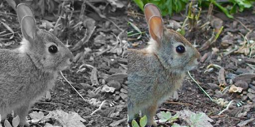
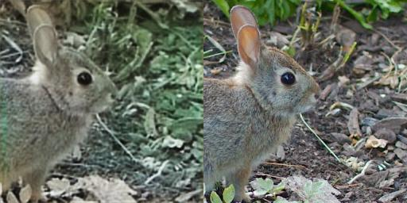

# Pix2pix final project implementation

This project contains a **pix2pix** neural network implementation, 
loading scripts and trained models for two demo datasets. The code
was written by Aleksey Yakovlev (StepikId: **460409082**).

## Model trained on [UT Zappos50K](http://vision.cs.utexas.edu/projects/finegrained/utzap50k/) based dataset
Model receives 256x512 pixel pairs of images consisting of a contour and a
sample as input, and a 256x512 pixel pair consisting of an image and a sample
predicted by the contour is created at the output.

 &rarr; 

## Model trained on [Animals with attributes 2](http://cvml.ist.ac.at/AwA2/) based dataset
Model receives 256x512 pixels input pairs consisting of a black-and-white
image and its color sample, the output creates a 256x512 pixels pair consisting
of a neural network-colored image and its sample.

 &rarr; 


# Test

```bash
python3 test.py --test_count 100 --name edges2shoes --model e2s.pth
python3 test.py --shuffle 0 --name animals --model ans.pth
```

Parameters:

**name** : dataset name

**data_root** : path to the datasets directory (default ./data)

**batch_size** : test batch size (default 64)

**test_dir** : path to the test files directory (default ./test)

**test_count** : maximum number of test images generated (default all possible)

**shuffle** : test images sequence shuffle (default 1)

**model** : input generator data file name (default generator.pth)

**gpu** : gpu number (default 0)


# Load 'edges2shoes' based on [UT Zappos50K](http://vision.cs.utexas.edu/projects/finegrained/utzap50k/) dataset

```bash
python3 load_edges2shoes.py
```

This dataset used for demonstrations of the solution to the image recovery problem.

Parameters:

**data_root** : path to the datasets directory (default ./data)


# Load and adoption [Animals with attributes 2](http://cvml.ist.ac.at/AwA2/) to 'animals' dataset

This adopted dataset used for demonstrations of the solution to the colorization problem.

```bash
python3 load_animals.py
```
Parameters:

**data_root** : path to the datasets directory (default ./data)

**crop_count** : the number of different training images obtained by cropping the original (default 2)

**crop_size** : crop window size (default 512)

**train_size** : train vs validation split ratio (default 0.8)

**gpu** : gpu number (default 0)


# Train

```bash
python3 train.py --name edges2shoes --model e2s.pth
python3 train.py --name animals --model ans.pth
```

Parameters:

**name** : dataset name

**data_root** : path to the datasets directory (default ./data)

**epochs** : number of epochs training (default 200)

**gf** : number of generator input filters (default 64)

**df** : number of discriminator input filters (default 64)

**batch_size** : train batch size (default 64)

**noise** : discriminator input noise (default 0.05)

**learn_rate** : learn rate (default 0.0002)

**log_dir** : path to the log files directory (default ./log)

**log_rate** : rate by issuing samples by epochs (default 1)

**log_samples** : number of samples per logging epoch (default 5)

**model** : output generator data file name (default generator.pth)

**gpu** : gpu number (default 0)
